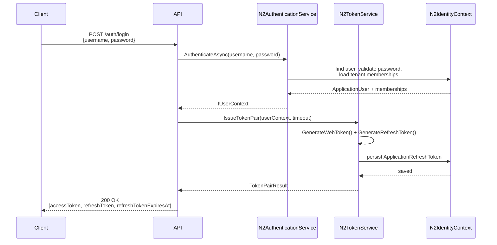
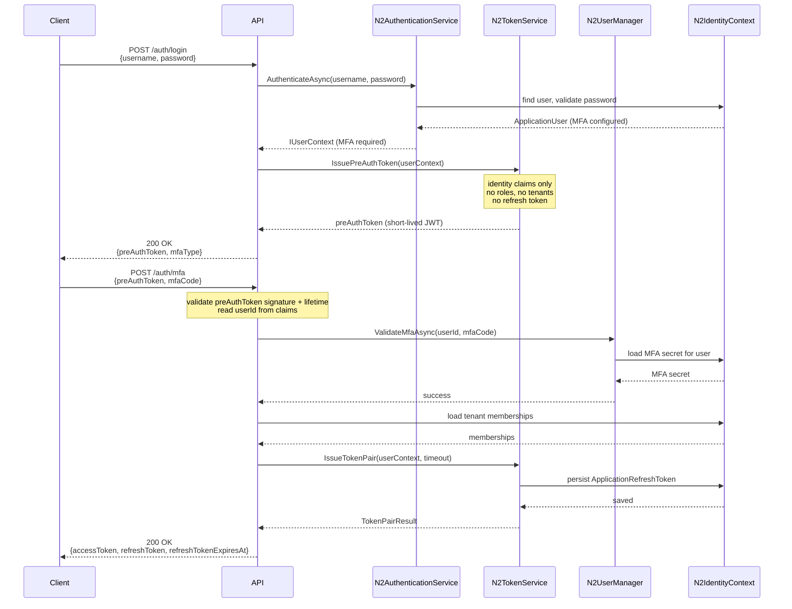
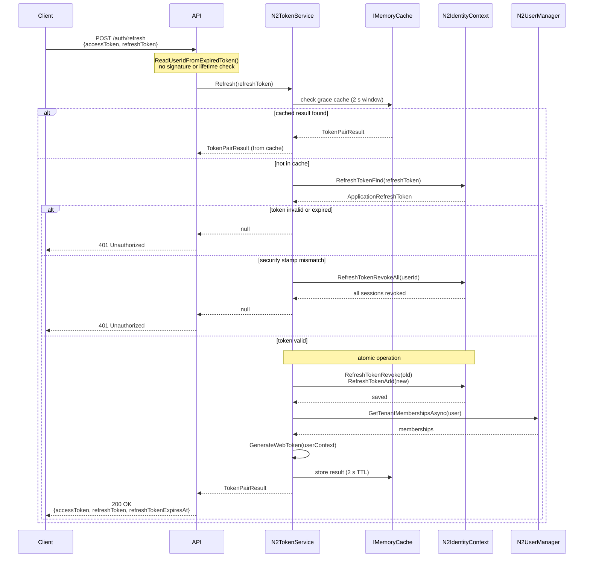
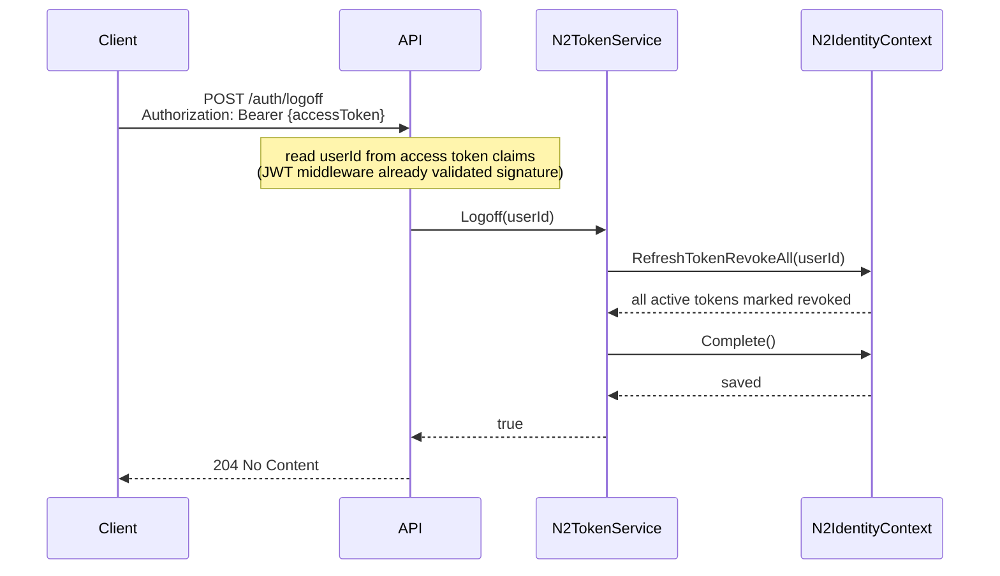

# Authentication Flow

This document describes the authentication flows supported by N2.Core.Identity,
covering standard login, MFA login, token refresh, and logoff.

---

## Components involved

| Component | Role |
|---|---|
| `N2AuthenticationService` | Validates credentials and returns an `IUserContext` |
| `N2UserManager` | Looks up users and tenant memberships from the database |
| `N2TokenService` | Issues, refreshes, and revokes JWT access tokens and refresh tokens |
| `WebTokenGenerator` | Builds and signs JWTs |
| `N2IdentityContext` | Persists refresh tokens |

---

## 1. Standard login (no MFA)

The client submits credentials and receives a token pair immediately.



**Access token lifetime:** configured via `JwtSettings.TokenExpirationInMinutes` (default: 5 min).  
**Refresh token lifetime:** configured via `JwtSettings.RefreshTokenExpirationInMinutes` (default: 24 h).

---

## 2. MFA login

When the user has MFA configured, the flow is split into two steps. A short-lived
pre-authentication token acts as a session handle between the credential check and
the MFA confirmation.



**Pre-auth token lifetime:** configured via `JwtSettings.PreAuthTokenExpirationInMinutes` (default: 60 min).  
The pre-auth token carries only `NameIdentifier`, `GivenName`, `Email`, and `MobilePhone` claims.
It is signed with the same key as access tokens but contains no roles or tenant memberships,
so it cannot be used to call protected API endpoints.

---

## 3. Token refresh

The client presents its current refresh token alongside the expired (or still-valid)
access token. The access token is used only to identify the user without a DB lookup;
the refresh token is the actual credential.



### Grace period

If the client makes duplicate refresh calls within the 2-second grace window (e.g. a retry
after a dropped connection, or two simultaneous requests), both calls receive the same new
token pair from the in-memory cache. The old token is revoked only once. This prevents
the second call from failing with "token already used."

### Security stamp validation

If the refresh token row carries a security stamp that no longer matches the user's current
stamp (e.g. because the user changed their password after the token was issued), all active
refresh tokens for that user are immediately revoked and `null` is returned. The client must
re-authenticate with credentials.

---

## 4. Logoff

The client logs out by sending its current access token. The API reads the user ID from
the token and revokes all outstanding refresh tokens for that user. The access token itself
remains valid until it expires; if security stamp validation is enabled
(`AddSecurityStampValidation()`), the next request with the old access token will be
rejected within the stamp validity window.



To also invalidate the access token immediately, the API should rotate the user's security
stamp after logoff (e.g. via `N2UserManager.UpdateSecurityStampAsync`). With stamp validation
enabled, all in-flight access tokens are then rejected within the configured stamp validity
window (default: 5 minutes).

---

## Configuration reference

All settings live under `AuthenticationConfig` in `appsettings.json`:

```json
{
  "AuthenticationConfig": {
    "JwtSettings": {
      "Secret": "<base64-encoded 32+ byte key>",
      "Issuer": "your-app",
      "Audience": "your-audience",
      "TokenExpirationInMinutes": 5,
      "PreAuthTokenExpirationInMinutes": 60,
      "RefreshTokenExpirationInMinutes": 1440
    }
  }
}
```

### DI registration (consuming app)

```csharp
builder.Services.AddJwtBearerAuthentication(configuration);  // registers IWebTokenGenerator
builder.Services.AddN2TokenService();                         // registers IN2TokenService
// optional — rejects access tokens when the user's security stamp has changed:
builder.Services.AddSecurityStampValidation(stampValidityWindowMinutes: 5);
```
